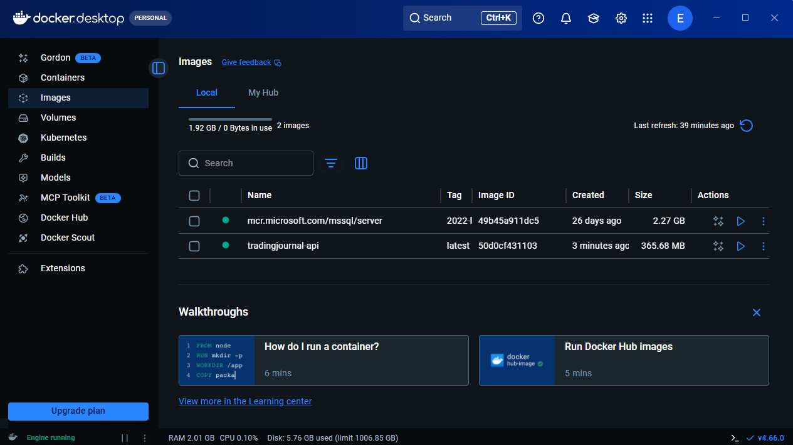
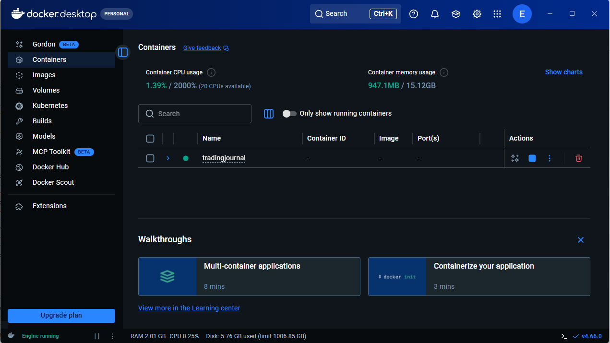
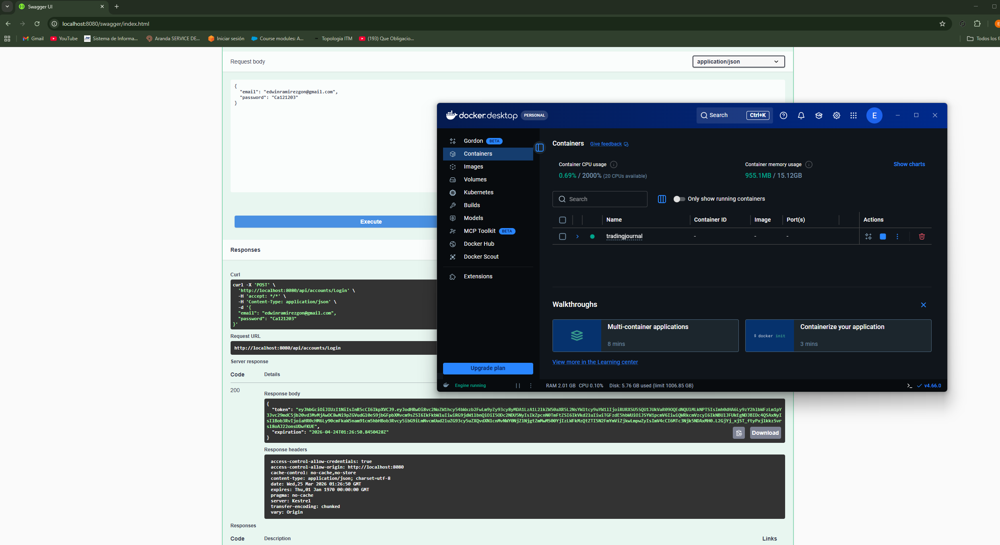
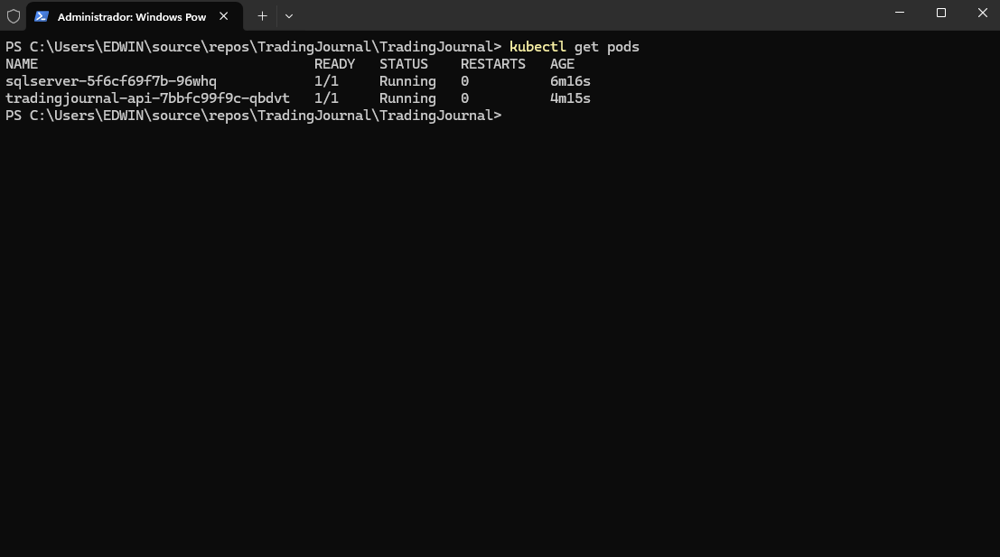
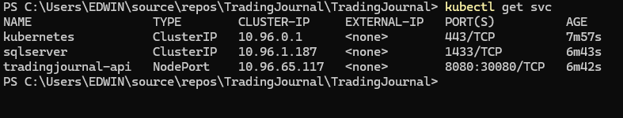
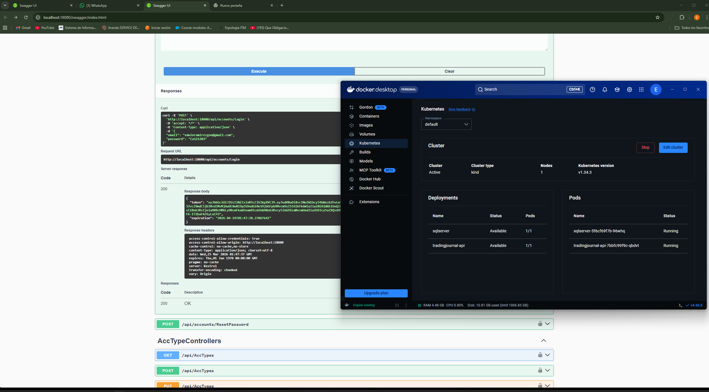
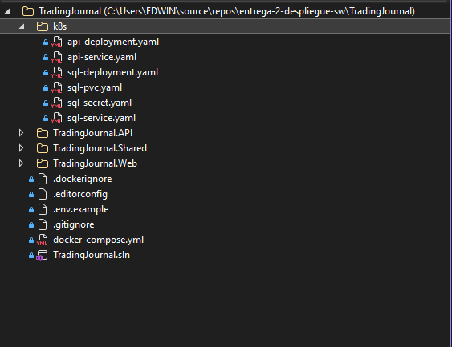
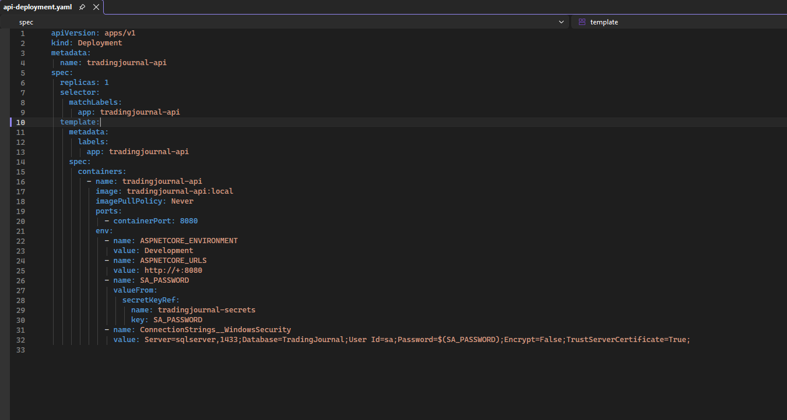

# Entrega 2 - Despliegue de Software

Práctica 2 (20%) - Contenerización y orquestación de una API REST con Docker y Kubernetes.

## Integrantes

1. Edwin Ramirez Gonzalez
2. Juan Jose Rua David
3. Felipe Olaya Beneitez
4. Julian Andres Ramirez Bedoya
5. Argenis Alejandro Ruiz Cotes


## Video de evidencia

- YouTube: **https://www.youtube.com/watch?v=L33mdpuB_vU**

## Proyecto desplegado

- API: `TradingJournal.API` (.NET 8)
- Frontend: `TradingJournal.Web` (Blazor WebAssembly)
- Base de datos: SQL Server 2022 en contenedor
- Contenerización: `Dockerfile` + `docker-compose.yml`
- Orquestación: manifiestos en carpeta `k8s/`

## Alcance de esta práctica

- En esta entrega se desplegó backend (`TradingJournal.API`), frontend (`TradingJournal.Web`) y base de datos en Docker.
- En Kubernetes se validó el despliegue del backend + base de datos.

### ¿Cómo ejecutar el frontend localmente?

Desde Visual Studio:

- Establecer `TradingJournal.Web` como proyecto de inicio y ejecutar.

Desde terminal:

```powershell
dotnet run --project TradingJournal.Web
```

Si el frontend consume la API, usar una de estas URLs según el escenario:

- Docker: `http://localhost:8080`
- Kubernetes (port-forward): `http://localhost:18080`

## Parte 1 - Docker (local)

### Archivos usados

- `TradingJournal.API/Dockerfile`
- `TradingJournal.Web/Dockerfile`
- `TradingJournal.Web/nginx.conf`
- `docker-compose.yml`
- `.env.example`

### Ejecución

```powershell
docker compose --env-file .env.example up -d --build
```

Swagger:

- `http://localhost:8080/swagger`

Frontend:

- `http://localhost:8081`

## Parte 2 - Kubernetes (Docker Desktop)

### Manifiestos

- `k8s/sql-secret.yaml`
- `k8s/sql-pvc.yaml`
- `k8s/sql-deployment.yaml`
- `k8s/sql-service.yaml`
- `k8s/api-deployment.yaml`
- `k8s/api-service.yaml`

### Despliegue

```powershell
kubectl apply -f k8s/sql-secret.yaml -f k8s/sql-pvc.yaml -f k8s/sql-deployment.yaml -f k8s/sql-service.yaml -f k8s/api-deployment.yaml -f k8s/api-service.yaml
kubectl get pods
kubectl get svc
```

### Acceso a Swagger en Kubernetes

- Servicio NodePort configurado: `30080`
- Validación en este entorno por reenvío de puertos:

```powershell
kubectl port-forward svc/tradingjournal-api 18080:8080
```

Swagger:

- `http://localhost:18080/swagger`

## Evidencias (capturas)

### Evidencias Docker

- Contenedor/imagen Docker





### Evidencias Kubernetes

- `kubectl get pods`, `kubectl get svc`, Swagger y manifiestos








- Ver archivo: `Documento-Practica-2.md`
